# Apresentação 1.

## Desvio padrão

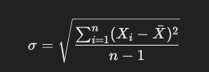

σ: Desvio padrão dos valores.
Xi​: Cada valor individual na série histórica.
XˉXˉ: Média dos valores.

n: Número total de valores na série histórica.

∑: Símbolo de soma, somando todos os (Xi−Xˉ)2(Xi​−Xˉ)2 de i=1i=1 até i=ni=n.

(Xi−Xˉ)2(Xi​−Xˉ)2: Diferença entre cada valor e a média, elevada ao quadrado.

## Intervalo de Confiança

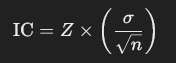

IC: Intervalo de confiança.

Z: Valor crítico da distribuição normal para o nível de confiança desejado

σ: Desvio padrão dos valores.

# Apresentação 2 QST 1

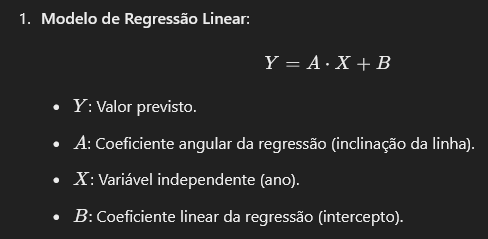

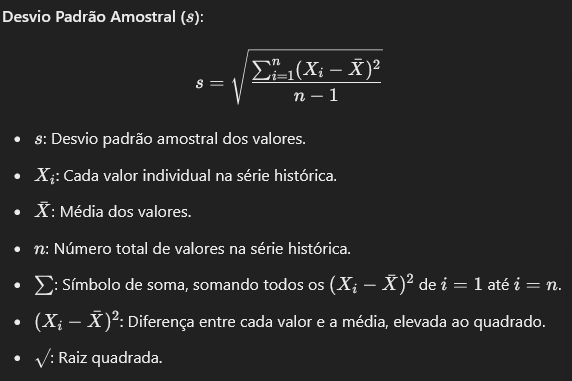

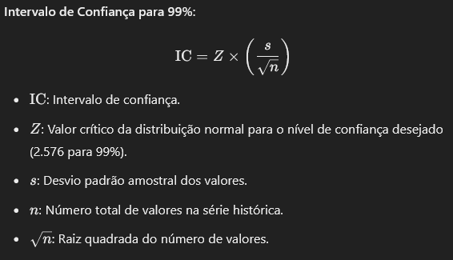

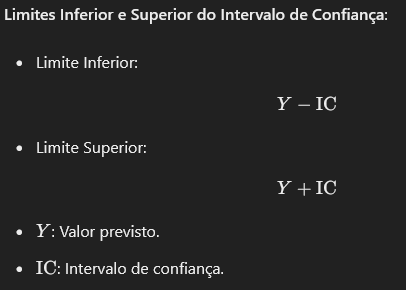

# Apresentação 2 QST 2

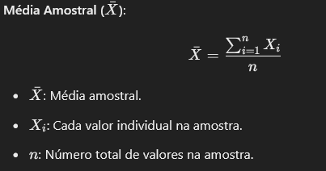

# Apresentação 3

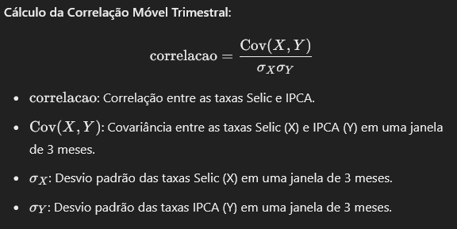

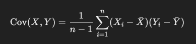

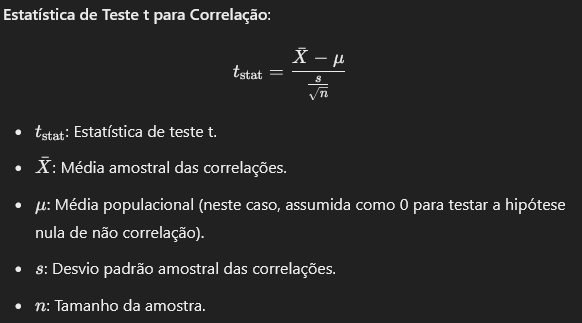

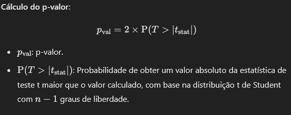

# Apresentação 4

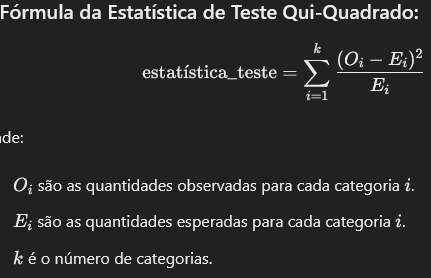

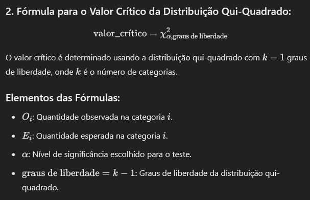

# Apresentação 5

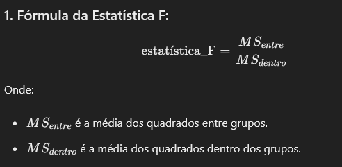

## Para calcular o MS

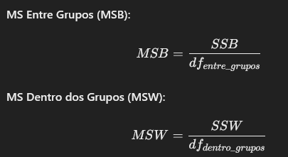

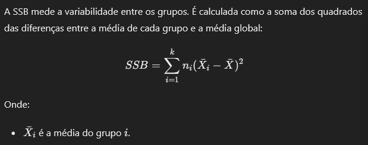

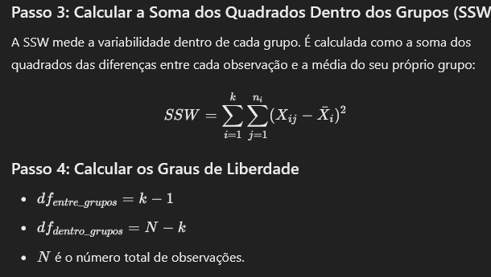

# Apresentação 6 

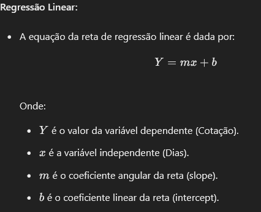

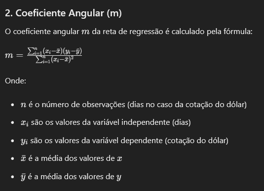

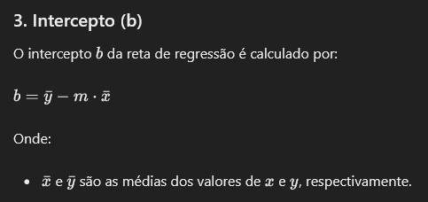

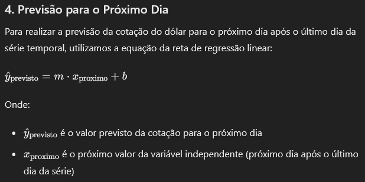

# Apresentação 7

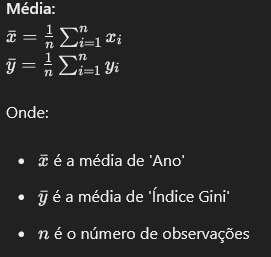

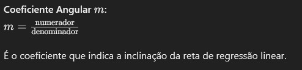

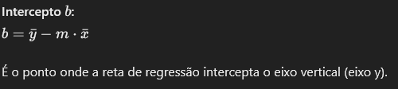

